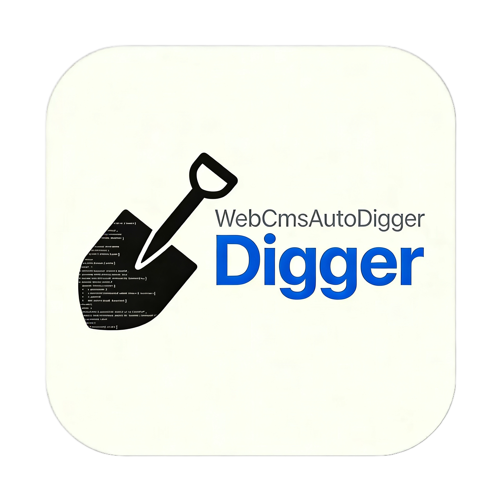

# WebCmsAutoDigger

一款基于 **OpenCode** + **LangGraph** 开发的 multi-agent 工具，用于 **PHP** 和 **Java** Web CMS 的自动漏洞挖掘，从**项目分析 → 攻击链分析 → 漏洞验证**全流程自动化，输出审计报告。

代码审计集成 **LSP** 与 **AST** 技术，可自动**逆向溯源**危险函数的调用链，并在 Docker 环境中**动态验证**漏洞可利用性。

<p align="center">
  
</p>
<h3 align="center">WebCmsAutoDigger</h3>
<p align="center">
  一个快速自动挖掘 Web CMS 项目漏洞并验证的工具！
  <br />
  <a href="https://github.com/jujubooom/WebCmsAutoDigger/blob/master/README.md"><strong>探索本项目的文档 »</strong></a>
</p>

## 目录

- [上手指南](#上手指南)
  - [系统要求](#系统要求)
  - [环境变量配置](#环境变量配置)
  - [模型配置](#模型配置)
  - [运行项目](#运行项目)
- [工作流程](#工作流程)
- [文件目录说明](#文件目录说明)
- [使用到的框架](#使用到的框架)
- [作者](#作者)
- [版权说明](#版权说明)

### 上手指南

#### 系统要求

- Python ≥ 3.13
- JDK 17+（Java 项目审计需要）
- Docker（自动构建/验证需要）
- Node.js（PHP LSP 需要）

#### 环境变量配置

将 API Key 设置为环境变量：

```bash
export DEEPSEEK_API_KEY="your-deepseek-api-key"
export OPENAI_API_KEY="your-openai-api-key"        # 可选
```

项目启动时会自动将环境变量中的 Key 注入到 OpenCode。

#### 模型配置

1. 先通过 `--checkmodel` 查看当前可用的 Provider 和模型：

```bash
python main.py --checkmodel
```

2. 根据输出，编辑 `config/agent_config.py` 中对应 Agent 的 `model` 字段：

```python
# config/agent_config.py
AGENTS = {
    "tracer": {
        ...
        "model": {"providerID": "deepseek", "modelID": "deepseek-v4-flash"},
    },
    ...
}
```

#### 运行项目

```bash
git clone https://github.com/jujubooom/WebCmsAutoDigger.git
cd WebCmsAutoDigger

pip install -r requirements.txt   # 或手动安装依赖
python main.py --dir <要审计的项目路径>
```

##### 高级选项

| 参数 | 说明 |
|---|---|
| `--dir <path>` | 要审计的项目路径（必填） |
| `--autobuild` | 自动 Docker 构建并部署 CMS |
| `--mock` | Mock 模式，跳过 LLM 调用用于调试 |
| `--loadjson <file>` | 加载已有的 sink 扫描结果，跳过 sss 扫描 |
| `--buildinfo <file>` | 使用已有的构建信息文件 |
| `--checkmodel` | 列出可用模型 |
| `--name <name>` | 自定义任务名称 |

### 工作流程

```
项目源码
   │
   ▼
sss 扫描 ──────────────── 识别所有危险函数调用点（sink）
   │
   ▼
Tracer Agent ─────────── LSP + AST 逆向污点追踪
   │                      输出：trace_report.md + 可控/不可控 判定
   ▼
Verifier Agent ───────── 动态验证漏洞可利用性（Docker 环境）
   │                      输出：验证报告 + 利用脚本
   ▼
审计报告 ─────────────── 增量生成 audit_report.md
```

**核心 Agent：**

| Agent | 职责 |
|---|---|
| **Tracer** | 从 sink 点出发，利用 LSP（Go to Definition / Find References / Call Hierarchy）逆向追踪参数来源，判定是否用户可控 |
| **Verifier** | 读取追踪报告，在 Docker 环境中动态验证漏洞，编写利用脚本 |
| **Builder** | 自动分析 CMS 技术栈，编写 Dockerfile，构建并部署到 Docker |

**特性：**
- **断点续传**：通过 `progress.json` 记录进度，中断后可继续
- **知识积累**：`trace_kb.md` / `verify_kb.md` 跨任务复用审计经验
- **增量报告**：每验证一个 sink 组即追加到 `audit_report.md`

### 文件目录说明

```
├── main.py                     # CLI 入口
├── config/
│   ├── agent_config.py          # Agent 定义与系统提示词
│   └── view_config.py           # 运行时 UI 与权限配置
├── helper/
│   └── sss                      # PHP sink 扫描器（Go 二进制）
├── mock/                        # Mock 模式，调试用
├── orchestrate/
│   ├── graph.py                 # LangGraph 工作流定义
│   ├── nodes.py                 # 工作流节点实现
│   ├── presets.py               # 初始状态工厂
│   └── state.py                 # 状态定义
├── prompt/
│   ├── builder/system.md        # Builder Agent 系统提示词
│   ├── tracer/
│   │   ├── system_php.md        # Tracer PHP 系统提示词
│   │   ├── task_php.md          # Tracer PHP 任务模板
│   │   └── task_java.md         # Tracer Java 任务模板
│   └── verifier/
│       ├── system_php.md        # Verifier PHP 系统提示词
│       └── system_java.md       # Verifier Java 系统提示词
├── server/
│   ├── client.py                # OpenCode REST API SDK
│   ├── providers.py             # API Key 注入与模型管理
│   └── task.py                  # OpenCode serve 进程生命周期
├── skills/
│   └── webcms-installer/        # CMS Docker 安装技能
├── images/
│   └── logo.jpeg
├── LICENSE.txt
└── README.md
```

### 使用到的框架

- [OpenCode](https://github.com/anthropics/opencode) — Anthropic 的 agentic 编码平台
- [LangGraph](https://langgraph.com.cn/) — 工作流编排

### 作者

@[Ewoji](https://ewoji.cn/)

### 版权说明

该项目签署了 MIT 授权许可，详情请参阅 [LICENSE.txt](LICENSE.txt)
